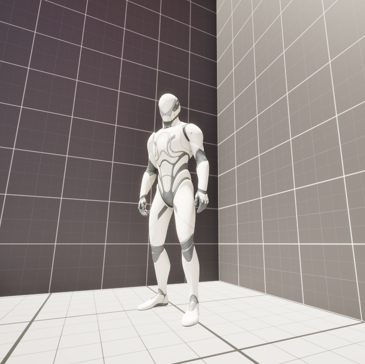

# Advanced NPCs

Advanced NPCs is a modular Unreal Engine 5 framework for creating flexible, configurable and believable NPC behaviour.

> Version 1.0 for Unreal Engine 5.7.
[Documentation](#documentation) • [Roadmap](ROADMAP.md) • [Changelog](CHANGELOG.md) • [Support](SUPPORT.md)

## Overview

Many NPC systems are designed around rigid categories such as enemies, companions or bosses. Advanced NPCs instead provides reusable systems that developers can configure for different characters and gameplay situations.

The framework is implemented as a C++ Unreal Engine plugin with separate Runtime and Editor modules.

## Core Systems

* Configurable Intents
* Intent Sets and per-NPC overrides
* Conditions and condition groups
* Attributes, emotions and personality values
* NPC capabilities
* Priority, interruption and cooldown rules
* Patrol, follow and wander behaviours
* Movement modifiers
* Runtime state management
* Developer-focused editor customizations

## Documentation

Complete user documentation is available here:

[Advanced NPCs Official Documentation v1.0](docs/AdvancedNPCs_OfficialDocumentation_v1.0.pdf

## Availability

Advanced NPCs v1.0 is prepared for distribution through Fab.

Supported version: Unreal Engine 5.7  
Supported platform: Win64

## Support and Feedback

Use the Issues section of this repository to report bugs, request features or provide feedback.

When reporting a problem, please include:

* Unreal Engine version
* Steps required to reproduce the problem
* Expected result
* Actual result
* Relevant screenshots or logs

## Important Notice

This repository is the public information, documentation and support page for Advanced NPCs. Plugin source code and downloadable binaries are not distributed through this repository.

Demo and third-party content included with or shown alongside Advanced NPCs is subject to its respective licensing terms. See [THIRD_PARTY_NOTICES.md](THIRD_PARTY_NOTICES.md) for details.

© 2026 Spandan Wagh. All rights reserved.
